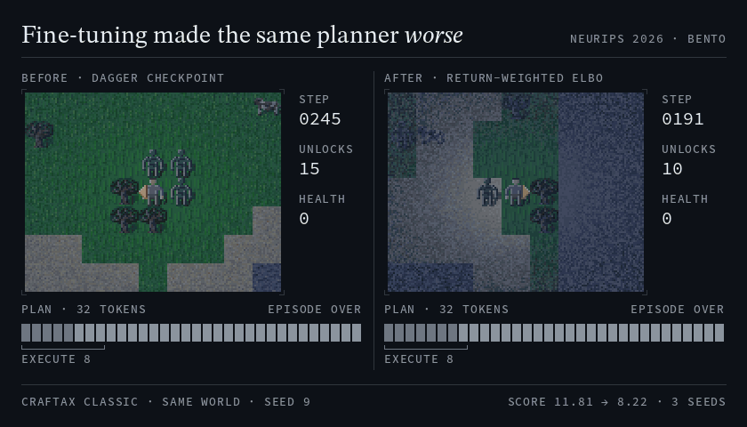
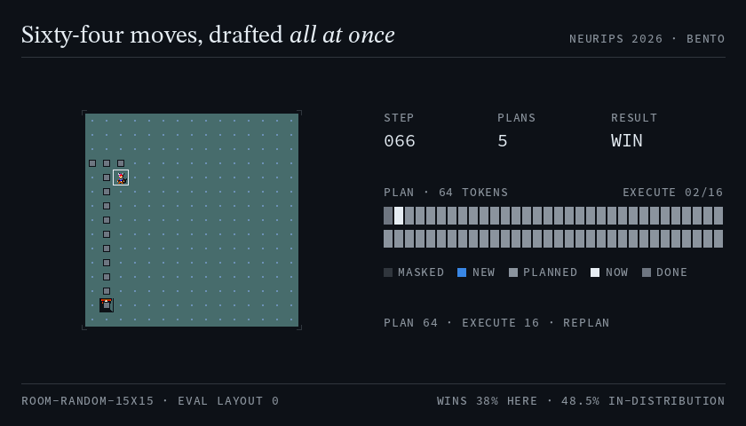
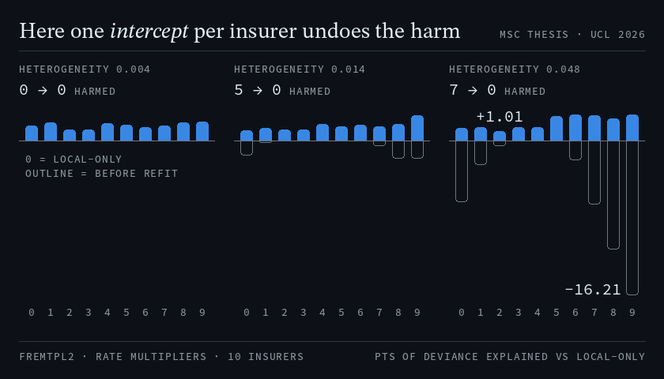

# Mathis Weil

ML engineer and researcher working on diffusion planners, RL fine-tuning and federated learning. London.

[Email](mailto:mathis.weil@outlook.com) · [LinkedIn](https://www.linkedin.com/in/mathis-weil/) · [Google Scholar](https://scholar.google.com/citations?user=HZLNhcoAAAAJ) · [OpenReview](https://openreview.net/profile?id=~Mathis_Weil1) · [Hugging Face](https://huggingface.co/mathisweil) · [CV](assets/mathis-weil-cv.pdf)

I have just finished the MSc in Data Science and Machine Learning at UCL, with a co-first-authored NeurIPS 2026 workshop paper on masked diffusion planners and a thesis on federated gradient boosting for insurance pricing, in collaboration with Ki, a digital syndicate in the Lloyd's market.

**Open to ML engineering, applied research and data science roles in London.** UK Graduate visa, no sponsorship needed.

## News

- **Sep 2026** · Paper accepted at the [NeurIPS 2026 BeNTo workshop](https://bento-neurips.github.io/) (Sydney, 12 December).
- **Sep 2026** · Submitted my MSc thesis on federated gradient boosting, in collaboration with Ki.
- **May 2026** · Co-authored [*The Human Transformation that will Power your Agentic Future*](https://web.archive.org/web/20260710225021/https://www.mgmt.ucl.ac.uk/sites/default/files/upload/Analytics%20Lab%202026%20.pdf) with the UCL School of Management Analytics Lab and Capgemini.

## Research

### Return-Weighted ELBO Fine-Tuning Degrades Masked Diffusion Planners

<a href="https://github.com/mathisweil/craftax-ReMDM-planner"></a>

<sub>Same world and seed (seed 9, picked by a fixed rule; the script prints the sweep). Right: the paper's baseline_rl condition, retrained with the paper command. Each 32-action plan is denoised in 50 steps; 8 actions run before replanning.</sub>

Muhammad Ali Khan\*, **Mathis Weil**\*, Ahmet H. Güzel, Jack Parker-Holder, Ilija Bogunovic<br>
*NeurIPS 2026 Workshop: Beyond Next-Token Prediction (BeNTo)* · Sydney, December 2026 · <sub>\* equal contribution</sub><br>
[Paper](https://openreview.net/forum?id=VGyjG8Gy29) · Code: [Craftax (JAX)](https://github.com/mathisweil/craftax-ReMDM-planner), [MiniHack (PyTorch)](https://github.com/mathisweil/minihack-ReMDM-planner) · Checkpoints: [Craftax](https://huggingface.co/mathisweil/remdm-craftax-checkpoints), [MiniHack](https://huggingface.co/mathisweil/remdm-minihack-checkpoints)

Masked diffusion planners denoise a whole action plan at once and can revise any part of it. Fine-tuning them on return with a return-weighted ELBO, the standard tractable objective, makes them worse. I am the lead developer of both codebases.

- **No condition beats the starting checkpoint on Craftax Classic.** The planner scores 11.81; after 500 iterations the baseline scores 8.22, and none of 25 conditions (three seeds each) ends above where it started.
- **The return signal does not explain the drop.** An exact gradient decomposition puts the return term at about half the imitation gradient, yet advantage clipping, which cuts it fivefold, scores lower still.
- **Most of the drop is a sampling mismatch.** In a same-host re-run, collecting rollouts at the evaluation settings shrinks the drop from 3.68 to 0.26 points.

<details>
<summary>MiniHack: the planner drafts 64 moves at once</summary>

<a href="https://github.com/mathisweil/minihack-ReMDM-planner"></a>

<sub>Shown: evaluation layout 0, won in 66 moves (picked by a fixed rule; the script prints it). On this room it wins 38% of episodes, and 48.5% across the four in-distribution layouts (paper Table 8).</sub>

</details>

<details>
<summary>BibTeX</summary>

```bibtex
@inproceedings{khan2026returnweighted,
  title     = {Return-Weighted {ELBO} Fine-Tuning Degrades Masked Diffusion Planners},
  author    = {Muhammad Ali Khan and Mathis Weil and Ahmet H. G{\"u}zel and Jack Parker-Holder and Ilija Bogunovic},
  booktitle = {Beyond Next Token Prediction: Diffusion and Flow Models for Next-Generation Decoding},
  year      = {2026},
  url       = {https://openreview.net/forum?id=VGyjG8Gy29}
}
```

</details>

### Federated Gradient Boosting for Commercial Insurance Risk Modelling

MSc thesis, UCL, in collaboration with Ki through UCL IXN · Supervisor: Prof Philip Treleaven · September 2026



<sub>Method panels are illustrative; results are public freMTPL data across ten simulated insurers, with claim rates pushed apart by rate multipliers.</sub>

Insurers cannot pool their claims data. I built a federated XGBoost benchmark in which each insurer keeps its raw records and shares only histogram sums, verified that it reproduces the pooled model, and measured insurer by insurer, under a pre-registered protocol, when sharing helps and when it hurts. Results here use the public freMTPL motor data: 678k policies across ten simulated insurers.

- **Federation reproduces pooling.** On equal random splits it recovers a median 0.99 of the pooled model's per-insurer gain (pre-registered bar: 0.5), and a correctness gate checks it against the pooled model.
- **Where sharing hurts, and a fix.** As rate multipliers push claim rates apart, the shared model prices 0, then 5, then 7 of 10 insurers worse than their own model (worst: 16.2 points of deviance explained). On this dial, refitting one intercept per insurer puts all ten back above.

<sub>XGBoost federated histogram aggregation · Flower · PyTorch · Hydra · 13.5k lines · 592 tests · strict mypy · CI</sub>

Code is private to Ki; access on request through Ki.

## Other projects

- **[Eviction-aware fine-tuning](https://github.com/mathisweil/evo-memory)** · LoRA fine-tuning of Llama-3.2-1B while a learned policy (NAMM) evicts 75–85% of the KV cache: 28.9 F1 on five LongBench QA tasks, against 19.0 for standard fine-tuning under the same eviction and 32.6 with the full cache. UCL team project of five, built on Sakana AI's NAMM ([report](https://github.com/mathisweil/evo-memory/blob/main/UCL_NLP_2026.pdf)).
- **[SkillFindr](https://github.com/mathisweil/SkillFindr-SemanticSearchEngine)** · Semantic search and a RAG API over 1,200+ IBM SkillsBuild courses (Sentence-BERT, pgvector, FastAPI): Recall@20 0.899 and MRR 0.843 on 50 annotated queries. QMUL final-year project with IBM.
- **[BidBird](https://github.com/mathisweil/bidwell_hackathon)** · Planning- and appeal-outcome risk models (Random Forest, XGBoost) served through FastAPI. 1st place with a UCL team at the Bidwells Real Estate Planning Hackathon, November 2025.

## Background

- **Machine Learning Researcher**, Ki, Jun–Sep 2026 · MSc thesis research, embedded in the underwriting team
- **MSc Data Science and Machine Learning**, University College London, 2025–2026
- **Postgraduate Teaching Assistant**, UCL, 2025–2026 · weekly practicals and marking for 280+ MSc and BSc students
- **BSc Computer Science**, Queen Mary University of London, 2022–2025 · First Class Honours (83%), Final-Year Prize, Demonstrator of the Year 2025 (one of 14 in computer science)
